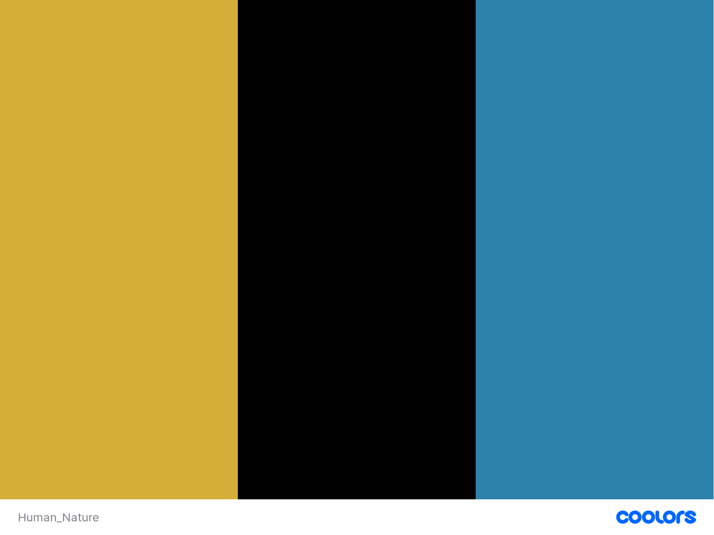

# Master Yourself

Welcome to the Website that will allow you to learn Human Nature with Robert Greene, the modern Macchiavelli. The site offers an overview about Robert Greene, his books and how his masterpieces will allow you to get invaluable insights about Human Nature, helping you to know deeper your persona and to navigate wisely the social arena.

Master Yourself has a simple and user-friendly design, aiming as well at conveying the value of Greene's books.

Check out our site at <https://github.com/aedoardo1990/Master_Human_Nature>

---

# Content

- [User Experience](#user-experience)
  - [Target Audience](#target-audience)
  - [User stories](#user-stories)
    - [Hiring Kasimir for a Missing Item Case](#hiring-kasimir-for-a-missing-item-case)
    - [I want to look up the success of Pawsome Detective](#i-want-to-look-up-the-success-of-pawsome-detective)
    - [I want user-friendly information from any device](#i-want-user-friendly-information-from-any-device)
    - [I want to contact the Pawsome Detectiv Agency](#i-want-to-contact-the-pawsome-detectiv-agency)
- [Design](#design)
  - [Colour Scheme](#colour-scheme)
  - [Typography](#typography)
  - [Imagery](#imagery)
  - [Wireframes](#wireframes)
    - [Desktop:](#desktop)
    - [Mobile:](#mobile)
  - [Design](#design-1)
- [Features](#features)
  - [General Features](#general-features)
    - [Navigation-Bar](#navigation-bar)
    - [Footer with Impressum](#footer-with-impressum)
    - [Header](#header)
    - [About](#about)
    - [Portfolio](#portfolio)
    - [Reviews](#reviews)
    - [Contact](#contact)
  - [Future Implementations](#future-implementations)
    - [Calender](#calender)
    - [Blog](#blog)
    - [Events and Workshops](#events-and-workshops)
    - [Price Table](#price-table)
    - [Hiring](#hiring)
  - [Accessibility](#accessibility)
    - [Fonts and Font Sizes](#fonts-and-font-sizes)
    - [Pictures](#pictures)
    - [Colors](#colors)
    - [Structural HTML](#structural-html)
- [Technologies Used](#technologies-used)
  - [Languages Used](#languages-used)
  - [Frameworks, Libraries & Programs Used](#frameworks-libraries--programs-used)
- [Deployment & Local Development](#deployment--local-development)
  - [Deployment](#deployment)
  - [Local Development](#local-development)
    - [How to Clone](#how-to-clone)
    - [How to Fork](#how-to-fork)
- [Testing](#testing)
  - [Manual Testing](#manual-testing)
    - [Jigsaw CSS Validator](#jigsaw-css-validator)
    - [W3C Validator](#w3c-validator)
    - [Lighthouse](#lighthouse)
    - [Accessibility](#accessibility-1)
  - [Full Testing](#full-testing)
    - [Testing by Hand](#testing-by-hand)
- [Ongoing Bugs](#ongoing-bugs)
  - [Mail Form doesn't send an email](#mail-form-doesnt-send-an-email)
  - [Review Gallery on small mobile](#review-gallery-on-small-mobile)
- [Fixed Bugs](#fixed-bugs)
  - [Label seems to drop in line with the input](#label-seems-to-drop-in-line-with-the-input)
  - [Mobile Navabar isn't centered](#mobile-navabar-isnt-centered)
- [Credits](#credits)

---

## User Experience

### Target Audience

The Master Yourself Website targets an audience of people interested in self-development, working mostly in business and politics, and anyone who is eager to learn more about Human Nature.

### User Stories

#### I want a clear overview of Greene books

As a fan of Greene, I want a website giving me a clear overview of all his books.

### Looking for valuable self-development books

I am a compulsive reader, especially of self development books. Often it is difficult to find really valuable books about this field. I hope to find great content on the Master Yourself Website.

### Looking for a free eBook

I love reading but I do not have much money to buy books every month. I would like to see if there is any option to get a free eBook. Culture and knowledge should be for free to improve our society.

## Design

### Color Scheme

The colors chosen for Master Yourself are black and metallic gold. They want to remind the colors of the book of Greene called "Mastery". Gold symbolizes wealth and prosperity, abundance and accomplishment throught history, reminding that Greene's books are a mix of distilled wisdom from the biographies of mutliple successful historical characters. Black symbolizes elegance, power, restraint, fear, evil and occult. It represents how Greene's books take deeply into analysis the so-called negative emotions of human beings, their dark side, but teaches as well how to control and master them for our own goals.

