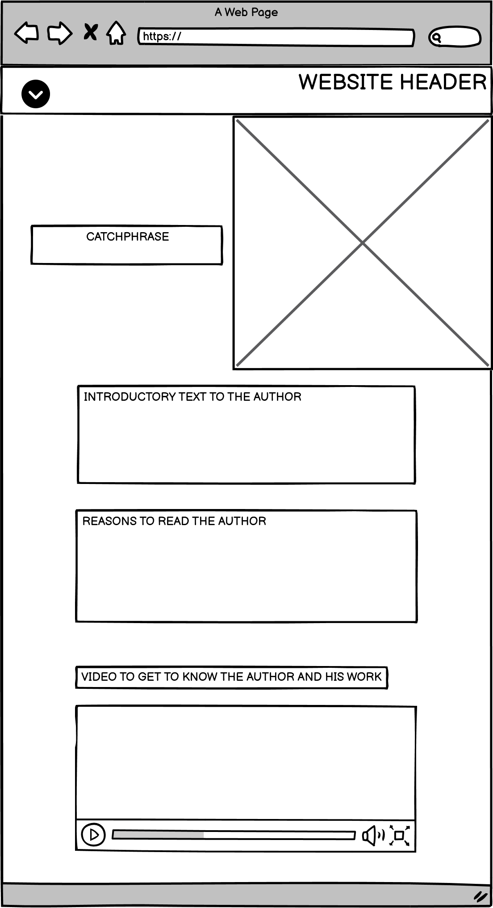
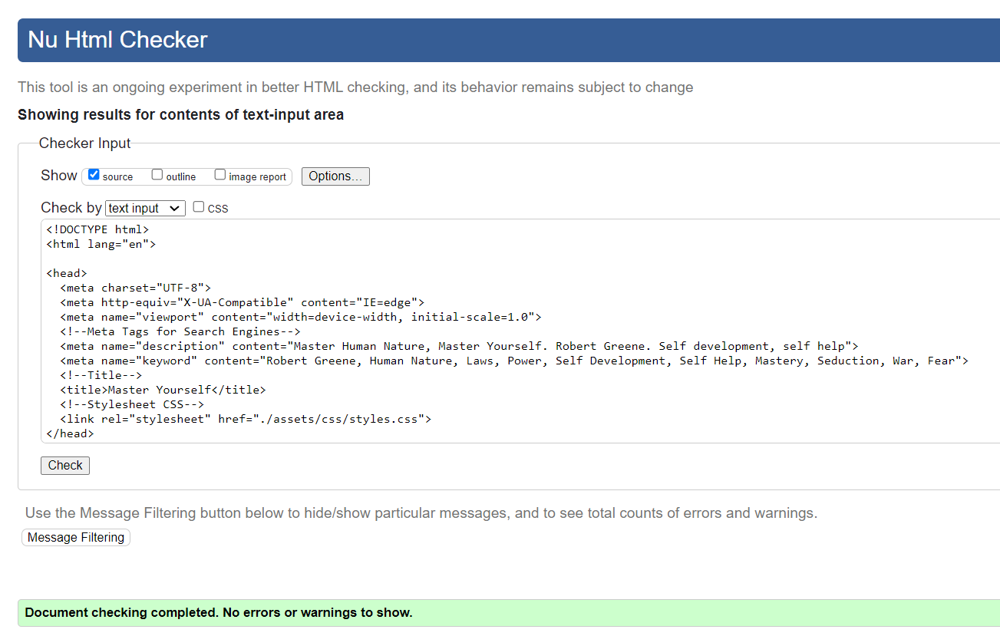
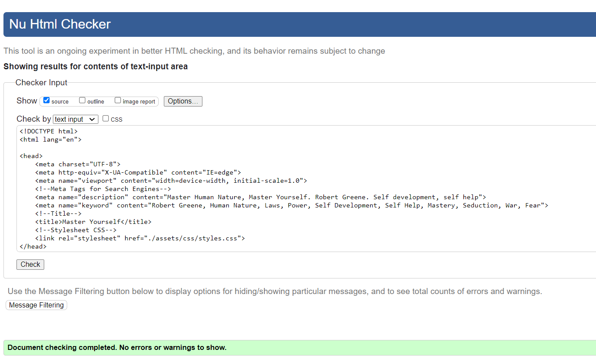
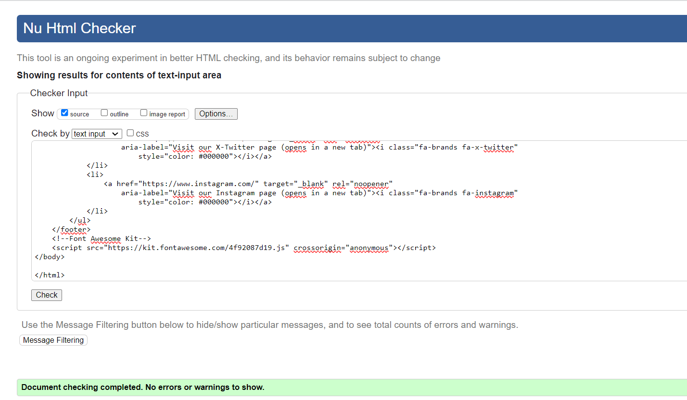
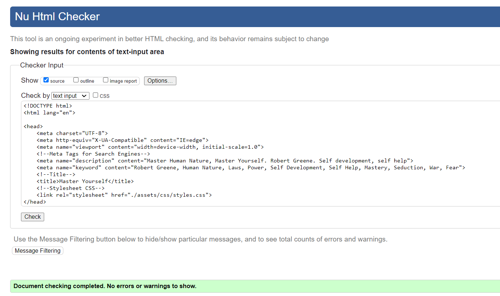
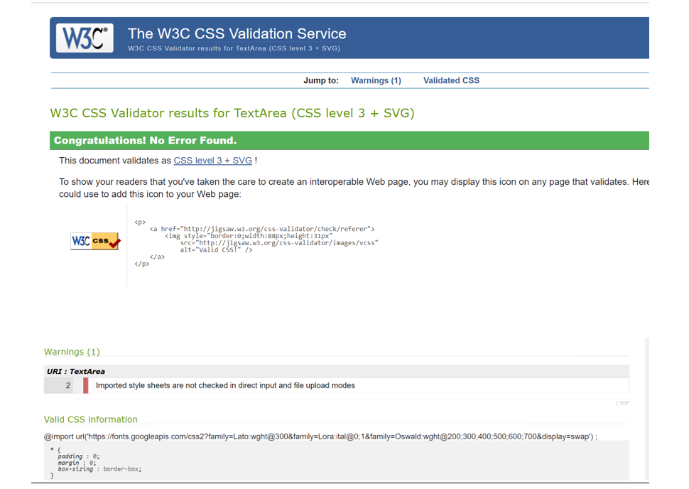
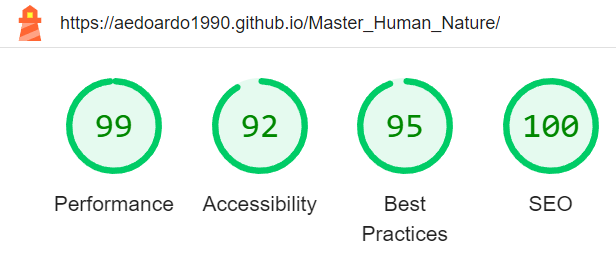
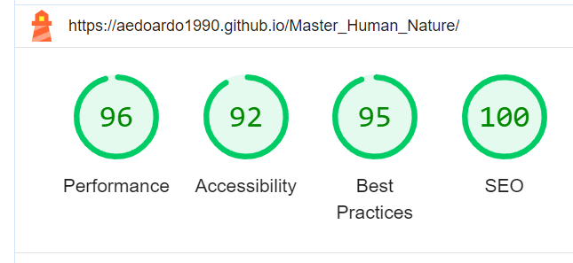

# Master Yourself

Welcome to the Website that will allow you to learn Human Nature with Robert Greene, the modern Macchiavelli. The site offers an overview about the books of Robert Greene and how the ywill allow you to get invaluable insights about Human Nature, helping you to know deeper your persona and to navigate wisely the social arena.

Master Yourself has a simple and user-friendly design, aiming as well at conveying the golden value of the content of Greene's books.

Check out our site at [https://aedoardo1990.github.io/Master_Human_Nature/]!

---

# Content

<!--Toc-->

- [User Experience](#user-experience)
  - [Target Audience](#target-audience)
  - [User stories](#user-stories)
    - [I want a clear overview of Greene books](#i-want-a-clear-overview-of-greene-books)
    - [Looking for valuable self-development books](#looking-for-valuable-self-development-books)
    - [Manager at Bank99 into self-development](#manager-at-bank99-into-self-development)
    - [Looking for a free eBook](#looking-for-a-free-ebook)
- [Design](#design)
  - [Colour Scheme](#colour-scheme)
  - [Typography](#typography)
  - [Imagery](#imagery)
  - [Wireframes](#wireframes)
    - [Desktop:](#desktop)
    - [Mobile:](#mobile)
  - [Design](#design-1)
- [Features](#features)
  - [General Features](#general-features)
    - [Navigation-Bar](#navigation-bar)
    - [Footer with Impressum](#footer-with-impressum)
    - [Header](#header)
    - [About](#about)
    - [Portfolio](#portfolio)
    - [Reviews](#reviews)
    - [Contact](#contact)
  - [Future Implementations](#future-implementations)
    - [Calender](#calender)
    - [Blog](#blog)
    - [Events and Workshops](#events-and-workshops)
    - [Price Table](#price-table)
    - [Hiring](#hiring)
  - [Accessibility](#accessibility)
    - [Fonts and Font Sizes](#fonts-and-font-sizes)
    - [Pictures](#pictures)
    - [Colors](#colors)
    - [Structural HTML](#structural-html)
- [Technologies Used](#technologies-used)
  - [Languages Used](#languages-used)
  - [Frameworks, Libraries & Programs Used](#frameworks-libraries--programs-used)
- [Deployment & Local Development](#deployment--local-development)
  - [Deployment](#deployment)
  - [Local Development](#local-development)
    - [How to Clone](#how-to-clone)
    - [How to Fork](#how-to-fork)
- [Testing](#testing)
  - [Manual Testing](#manual-testing)
    - [Jigsaw CSS Validator](#jigsaw-css-validator)
    - [W3C Validator](#w3c-validator)
    - [Lighthouse](#lighthouse)
    - [Accessibility](#accessibility-1)
  - [Full Testing](#full-testing)
    - [Testing by Hand](#testing-by-hand)
- [Ongoing Bugs](#ongoing-bugs)
  - [Mail Form doesn't send an email](#mail-form-doesnt-send-an-email)
  - [Review Gallery on small mobile](#review-gallery-on-small-mobile)
- [Fixed Bugs](#fixed-bugs)
  - [Label seems to drop in line with the input](#label-seems-to-drop-in-line-with-the-input)
  - [Mobile Navabar isn't centered](#mobile-navabar-isnt-centered)
- [Credits](#credits)

<!--Toc stop-->

---

## User Experience

### Target Audience

The Master Yourself Website targets an audience of people interested in self-development, working mostly in business, politics or social and working environments where people skills are fundamental. It aims as well at reaching anyone who is eager to learn more about Human Nature, to know oneself and the others thoroughly and ground their life and personal development in reality, past the pain and boredom of everyday life.

### User Stories

#### I want a clear overview of Greene books

I heard a lot about Greene books and I'd like to read one of them, but I do not from which one to start. I want a website giving me a clear overview of all his books, so that I could decide which suits better to my taste.

#### Looking for valuable self-development books

I am a compulsive reader, especially of self development books. It is often difficult to find valuable books in the self development field, since many of them are written mostly for profit and give superficial life advices rather than practical life-hacks. Greene has a very good reputation in this field and I hope that the  Master Yourself Website will help me to understand if he is the writer that I am looking for.

#### Manager at Bank99 into self-development

I have recently been promoted as Manager. Being in a managerial position, it is fundamental for me to understand deeply the dynamics of power and human behaviour within my company. I will check the Master Yourself website to have an overview about The 48 Laws of Power of Robert Greene or other of his books. Many people say that this book is the final guide for anyone who has power or wants to arm against those in power.

#### Looking for a free eBook

I love reading but I do not have much money to buy books every month. I would like to see if there is any option to get a free eBook. Culture and knowledge should be for free to help our society to blossom.

## Design

### Color Scheme

The colors chosen for Master Yourself are black, metallic gold and cerulean blue. They recall the colors of the book of Greene called "Mastery". Gold symbolizes wealth and prosperity, abundance and accomplishment throughout history, reminding that Greene's books are a mix of distilled wisdom from the biographies of mutliple successful historical characters. Black symbolizes elegance, power, restraint, fear, evil and occult. It represents how Greene's books take deeply into analysis the negative emotions of human beings, the dark side of human nature, but teaches as well how to control and master them for our own goals and wellbeing.
The color blue can be found only in the window on the index.html. Blue represents open spaces, imagination, the serenity and freedom that can come with wisdom and knowledge.
On the Get Free EBook page the "get your ebook" button becomes green when the form is submitted to confirm that it is the correct action to get the book.

### Typography

The Font chosen for the text on all the pages is Lora. Purpose of the font with the golden color is to be elegant, easy and pleasant to read. In the Newsletter section there is a live icon with a "jumping" book, that invites the visitor of the side to get the free eBook.

### Imagery

In the photo in the index.html page there is a younger Greene than his current age, which looks ambitious, clever and successful. The photo should mirror the personality of businessmen and politicians who would like to be like Robert Greene, or anyone aiming at self-developing. In "The Author" page there is Greene with his cat and surrounded by books. This page want to give some information about the life of the author and the photo with the pet conveys friendliness and familiarity with the author. The books around him remind of his knowledge. On the photo in the Get Free eBook page there are all the books of Greene together. They look on a "homy" surface and some of them are used. The photo wants to give the idea to the visitors of the site that with one click they can receive the free eBook and read it comfortably on the sofa of their home.

### Wireframes

The wireframes for the Master Yourself website were created with Balsamiq.

Wireframe for Desktop

Wireframe for Mobile

## Testing

### W3C-Validator

The result of the W3C Validator is all correct, except of the lines below where I get the following green message: "Trailing slash on void elements has no effect and interacts badly with unquoted attribute values. "

The message is due to a slash at the end of the end tag, that I removed multiple times but then it is added again by the IDE automatically anytime I save the HTML page.

### CSS-Validator

No errors after checking the code with  W3C Jigsaw CSS Validator. There is just one warning visible in the screenshot below at the bottom. This is due to the imported Google fonts.

### Lighthouse

Here below the score resulting from Lighthouse testing for the website.

And the following the result for the mobile version.

