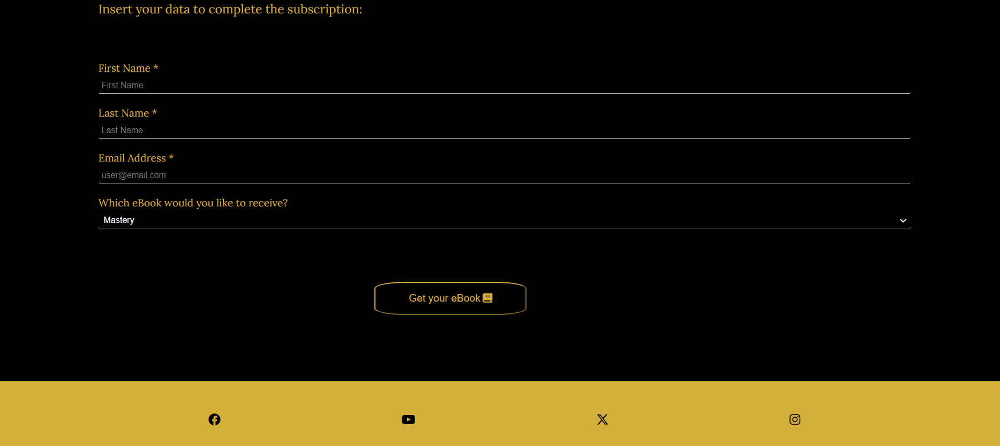

# Master Yourself

Welcome to the Website that will allow you to learn Human Nature with Robert Greene, the modern Macchiavelli. The site offers an overview about the books of Robert Greene and how they will allow you to get invaluable insights about Human Nature, helping you to know deeper your persona and to navigate wisely the social arena.

Master Yourself has a simple and user-friendly design, and a captivating look aiming at conveying the golden value of the content of Greene's books.

The live link of our site can be found here - [Master Yourself](https://aedoardo1990.github.io/Master_Human_Nature/).

## 

# Content

<!--Toc-->

- [Master Yourself](#master-yourself)
  - 
- [Content](#content)
  - [User experience](#user-experience)
    - [Target audience](#target-audience)
  - [User stories](#user-stories)
    - [First time user](#first-time-user)
    - [Returning user](#returning-user)
    - [Frequent user](#frequent-user)
  - [Design](#design)
    - [Color scheme](#color-scheme)
    - [Typography](#typography)
    - [Imagery](#imagery)
    - [Wireframes](#wireframes)
  - [Features](#features)
    - [The dropdown navigation menu](#the-dropdown-navigation-menu)
    - [The landing image](#the-landing-image)
    - [Reasons section and Youtube video](#reasons-section-and-youtube-video)
    - ["The Books" page](#the-books-page)
    - ["About the Author" page](#about-the-author-page)
    - ["Get Free eBook" page](#get-free-ebook-page)
    - [Footer](#footer)
  - [Features left to implement](#features-left-to-implement)
    - [Flip cards](#flip-cards)
    - [Video page](#video-page)
    - [ECommerce page](#ecommerce-page)
    - [Events page](#events-page)
  - [Testing](#testing)
    - [HTML-W3C-Validator](#html-w3c-validator)
    - [CSS-Validator](#css-validator)
    - [Lighthouse testing](#lighthouse-testing)
    - [Form testing](#form-testing)
    - [Browser testing](#browser-testing)
    - [Device testing](#device-testing)
    - [Mentor, family and friends testing](#mentor-family-and-friends-testing)
    - [Fixed bugs](#fixed-bugs)
      - [Dropdown menu not working properly on mobiles](#dropdown-menu-not-working-properly-on-mobiles)
      - [Images not loading on the pages "About the author" and "Get free eBook"](#images-not-loading-on-the-pages-about-the-author-and-get-free-ebook)
    - [Unfixed bugs](#unfixed-bugs)
  - [Technologies used](#technologies-used)
    - [Languages](#languages)
    - [Programs used](#programs-used)
  - [Deployment](#deployment)
  - [Credits](#credits)
    - [Contents](#contents)
    - [Media](#media)
    - [Code used](#code-used)
  - [Acknowledgements](#acknowledgements)

<!--Toc stop-->

---

## User experience

### Target audience

The Master Yourself Website targets an audience of people interested in self-development, working mostly in business, politics or in social environments where people skills are fundamental. It aims as well at reaching anyone who is eager to learn more about Human Nature, to know oneself and the others thoroughly and ground their life and personal development in reality, past the pain and boredom of everyday life.

## User stories

### First time user

- As a first time user I want to understand the main purpose of the website and learn about why I should read the books of Robert Greene
- As a first time I want to have a website that is easy to navigate and that would spark my interest
- As a first time user I want to have on overview of all the books of Greene and get some free content

### Returning user

- As a returning user I would like to get an overview about which book of Robert Greene I could read next
- As a returning user I would like to get an additional free eBook
- As a returning user I would check the video and the "About the author page" to know more about the background of the writer

### Frequent user

- As a frequent user I want to signup to the newsletter to get weekly practical advices in the field of self-development
- As a frequent user I want to get all the 7 free eBooks that are available on the site

## Design

### Color scheme

The colors chosen for Master Yourself are black, metallic gold and cerulean blue. The first two recall the colors of the cover of Greene's book entitled "Mastery". Gold symbolizes wealth and prosperity, abundance and accomplishment throughout history, reminding that Greene's books are a mix of distilled wisdom from the biographies of multiple successful historical characters. Black symbolizes elegance, power, restraint, fear, evil and occult. It represents how Greene's books take deeply into analysis the negative emotions of human beings, the dark side of human nature, but teaches as well how to control and master them for our own goals and wellbeing.
The color blue can be found only in the window on the index.html. Blue represents open spaces, imagination, the serenity and freedom that we can achieve with wisdom and knowledge.

### Typography

The Font chosen for the text on all the pages is Lora. Purpose of the font with the golden color is to be elegant, easy and pleasant to read. In the Newsletter section there is a live icon with a "jumping" book, that invites the visitor of the site to get the free eBook.

### Imagery

Images used for the website are photos of Robert Greene both in younger age - on the "Home" page - and as he looks today - on the "About the Author" page. On the pages "The Books" and "Get your free eBook" there are the captivating covers of his books.

### Wireframes

The wireframes for the "Master Yourself" website were created with Balsamiq.

1-Wireframe for Desktop

2-Wireframe for Mobile

## Features

### The dropdown navigation menu

The navigation menu can be accessed by clicking on the black round icon on the top left corner. When clicking or hovering on it each time - clicking for mobile version, hovering for the desktop version- the colors of the text and the background will reverse - from black to gold and from gold black - to facilitate the navigation.

### The landing image

- In the landing image there is a younger Greene than his current age, who looks ambitious, clever and successful. The photo should mirror the personality of businessmen and politicians who would like to be like Robert Greene, or anyone aiming at self-developing.
- On the left of the image there is a blue cerulean window introducing the worldwide reputation of Robert Greene as the modern Macchiavelli

### Reasons section and Youtube video

- Under the landing image of the Home page, there is a short introduction about the writer and a list of reasons about why the visitors should read the books of Robert Greene.
- At the bottom of the Home page, under the paragraph "Why should you read the books of Robert Greene?", there is a YouTube video in which Greene talks about Human Nature. The scope of the video is for the visitors of the website to get acquainted with Greene and his passion and knowledge about Human Nature, and to encourage them to visit the other pages of the site.

### "The Books" page

Here the visitors can find an introduction about the content of every book of Greene.

### "About the Author" page

In this page there is Greene with his cat and surrounded by books. This page wants to give some information about the life of the author and the photo with the pet conveys friendliness and familiarity with him. The books around him remind of his knowledge.

### "Get Free eBook" page

- Here the visitors have the opportunity to fill out a form to subscribe to our newsletter and get one of the books in eBook format. It is an option to promote free culture and knowledge for the sake of society and learning.

- On the photo of the page there are all the books of Greene. They look on a "homy" surface and some of them are used. The photo wants to give the idea to the visitors of the site that with "one-click" they can receive the free eBook and read it comfortably on the sofa of their home.

### Footer

- The footer allows to reach us on Facebook, X-Twitter, Youtube and Instagram, so that visitors can stay up-to-date with everything about Robert Greene and the publishing of his next books.

## Features left to implement

#### Flip cards

in "The Books" page, we would like to modify the cover of the books to become flip cards. When the user would click on the cover, this should flip and each time give a new short quote extracted from the book on which the visitor clicked.

#### Video page

We would like to add a Video page to the website, where new videos are published weekly about the teachings of Robert or his participation to public events

#### ECommerce page

We would like to develop an ecommerce page to provide the hard copies of our books directly to our customers.

#### Events page

We would like to create a page with the list of all the events to which Robert Greene will take part. Fans of Robert could buy their tickets to the event here and it would be a great opportunity to meet him in person.

## Testing

### HTML-W3C-Validator

The result of the W3C Validator is all correct, except of the lines below where I get the following green message: "Trailing slash on void elements has no effect and interacts badly with unquoted attribute values. "

The message is due to a slash at the end of the end tag, that I removed multiple times but then it is added again by the IDE automatically anytime I save the HTML page.

### CSS-Validator

No errors after checking the code with W3C Jigsaw CSS Validator. There is just one warning visible in the screenshot below at the bottom. This is due to the imported Google fonts.

### Lighthouse testing

Here below the score resulting from Lighthouse testing for the Website.

And the following the result for the Mobile version.

### Form testing

The form has been tested to ensure that it will not submit without the required fields being filled out - First Name, Last Name, Email-Address.

### Browser testing

The Website was tested on Google Chrome, Microsoft Edge and Safari with no issues. On Firefox the dropdown menu and the Form - just on Mobile - do not work completely.

### Device testing

The Website was tested on various devices, OnePlusNord10, iPhone13 mini, Google developer tools - Galaxy Fold, iPhone 12 pro, iPad mini, MacBook -, Desktop and created for the following screen sizes: 320px, 576px, 768px, 992px, 1240px and up.

### Mentor, family and friends testing

My mentor, my family and friends checked the site and helped to identify bugs and get a feeling about how the user-experience is perceived by visitors of the site.

### Fixed bugs

#### Dropdown menu not working properly on mobiles

- The dropdown menu was opening too quickly on mobile, and it was often redirecting to the Home page before having the time to select any of the other pages. This was because the dropdown hover fuction implemented in CSS works on desktop, but not on mobile where the hovering should be replaced by clicking.
- I was unsure what was the root cause, what of the elements to which I applied the CSS was the one provoking the issue.
- The issue was resolved by applying the CSS declaration "display:block" to all these elements as per line 97 of the CSS file.

#### Images not loading on the pages "About the author" and "Get free eBook"

- On the deployed version of the website, the images were not loading on the pages mentioned in the title.
- For the photo in the "About the author" page, I added a dot at the beginning of the url - src="./assets/images/robertGreeneCat.jpg" - and then the photo loaded successfully.
- For the second photo in the "Get free eBook" page, I removed the mentioned dot and I changed the name of the file to all lowercase - src=/assets/images/allthebooks.png . Then the loading worked out.

### Unfixed bugs

- Firefox Mobile: the layout of the form section does not display completely as it should. As mentioned in the Browser testing, the dropdown menu does not work completely in Firefox.
- Image on the "About the Author" page is slightly pixelated on big screen sizes. I tried to look for the same image with better quality but there was not in the web.

## Technologies used

### Languages

- HTML
- CSS

### Programs used

- [Balsamiq](https://balsamiq.com/) - to generate Wireframes
- [Chrome Dev Tools](https://developer.chrome.com/docs/devtools/) - for testing responsivness, development of the website and lighthouse testing
- [Google Fonts](https://fonts.google.com/) - to import fonts to the website
- [Font Awesome](https://fontawesome.com/) - for social media icons in footer and for the icon of the dropdown menu
- [W3C](https://www.w3.org/) - for HTML & CSS Validation.

## Deployment

The project was deployed using GitHub pages. The steps to deploy using GitHub pages are:

1. Go to the repository on GitHub.com
2. Select 'Settings' near the top of the page.
3. Select 'Pages' from the menu bar on the left of the page.
4. Under 'Source' select the 'Branch' dropdown menu and select the main branch.
5. Once selected, click the 'Save'.
6. Deployment should be confirmed by a message on a green background saying "Your site is published at" followed by the web address.

The link of the deployed site can be found here - [Master Yourself](https://aedoardo1990.github.io/Master_Human_Nature/)

## Credits

### Contents

The content about Robert Greene's biography, activity and the summary of his books was sourced from the below websites:

- [Wikipedia](https://www.wikipedia.org/)

- [Amazon](https://www.amazon.de/)

### Media

The video on the Home page was sourced from the Youtube channel of Robert Greene:

- [Robert Greene Official](https://www.youtube.com/@RobertGreeneOfficial)

The photos were taken from the following websites:

- [Wikipedia](https://www.wikipedia.org/) - landing image on the Home page
- [Pinterest](https://www.pinterest.it/) - covers of the books on "The Books" page and photo of the author on "About the author" page
- [Medium] (<https://medium.com/@keepasking/a-year-with-robert-greene-102876c9b4ca>) - photo of all the books on the page "Get free eBook"

### Code used

- Inspiration for the dropdown bar - [W3Schools](https://www.w3schools.com/howto/howto_css_dropdown.asp)
- Inspiration for the form menu - [Code Institute] (Coders Coffehouse Project, Love Running Project) and [Ferrari](https://www.ferrari.com/en-EN/auto/owner-reg)
- Starting structure of the site - [Code Institute] (Love Running Project)
- Books section for screens from 768px and up - line 394 of CSS code - [Amazon](https://www.amazon.de/-/en/Kommunikation-Psychologie-Business-Karriere-B%C3%BCcher/b/ref=dp_bc_aui_C_3?ie=UTF8&node=467524)
- Inspiration for the Readme - [mindyoga](https://github.com/AliOKeeffe/mindyoga/blob/main/README.md) and [pawsome](https://github.com/dasunicorn/pawsome)

## Acknowledgements

My mentor Antonio for his great support and all the useful advices.

My wife for her great love and support in everything I do.

Kay of Code Institute for the many tips on how to use different programs for the project.
